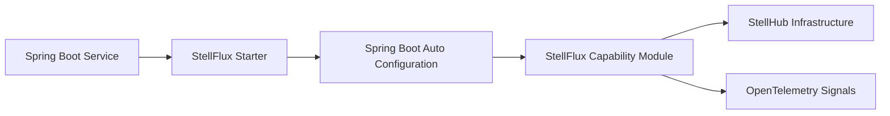

# StellFlux

[简体中文](./README_CN.md)

StellFlux is the Spring Boot foundation layer for the StellHub Java ecosystem. It provides a curated set of Maven modules, Spring Boot starters, auto-configuration components, and infrastructure integrations for building production-oriented Java services with consistent defaults.

The project is designed to reduce repeated middleware wiring across services while keeping each capability independently adoptable. Applications can opt into only the starters they need, such as HTTP, gRPC, service discovery, configuration, observability, caching, data access, distributed locking, messaging, and service governance.

## Project Scope

StellFlux is not a business framework and does not implement domain-specific application logic. It focuses on the infrastructure layer:

- Dependency and version alignment for StellHub Java services.
- Spring Boot auto-configuration for common middleware capabilities.
- First-class integrations with StellHub infrastructure projects such as StellMap, StellNula, StellOrbit, StellPulsar, and StellFlow.
- Consistent observability wiring for logs, metrics, and traces.
- Fine-grained starter modules so services can adopt capabilities incrementally.

## Status

| Item | Value |
| --- | --- |
| Project type | Java framework and Spring Boot starter collection |
| Primary runtime | Spring Boot 3 |
| Java baseline | Java 25 |
| Target users | Java microservices, platform services, infrastructure components |
| Maintainer | StellHub |
| Stability | Active development |

## Core Capabilities

| Area | Capability |
| --- | --- |
| Dependency management | `stellflux-bom` aligns framework, middleware, and starter versions |
| HTTP | HTTP client and server starter modules |
| gRPC | gRPC client and server starter modules |
| Observability | OpenTelemetry, logs, metrics, and traces integrations |
| Service discovery | StellMap registration, discovery, and load-balancer integration |
| Configuration | StellNula configuration center integration with Spring `Environment` and dynamic `@Value` refresh |
| Service governance | StellOrbit routing, circuit breaker, JWT authorization, local rate limiting, and weakly consistent distributed rate limiting |
| Rate limiting | Resilience4j local limiter and StellPulsar-backed distributed limiter, both supporting rejecting and blocking acquisition modes |
| Messaging | StellFlow producer and consumer integration |
| Caching | Caffeine local cache integration |
| Data access | DataSource auto-configuration and telemetry |
| Search | Elasticsearch 8.x client integration |
| Distributed lock | Jedis-based Redis lock with token validation and TTL renewal |
| Scheduling | StellMap-based distributed scheduler ownership checks |

## Module Layout

| Module | Purpose |
| --- | --- |
| `stellflux-bom` | Dependency management BOM |
| `stellflux-context` | Shared context primitives |
| `stellflux-opentelemetry` | OpenTelemetry helper APIs |
| `stellflux-log` | Logging integration |
| `stellflux-metrics` | Metrics integration |
| `stellflux-traces` | Tracing integration |
| `stellflux-http-client` | HTTP client capability |
| `stellflux-grpc-client` / `stellflux-grpc-server` | gRPC client and server capabilities |
| `stellflux-loadbalancer` | Load-balancer abstraction |
| `stellflux-loadbalancer-stellmap` | StellMap-backed service instance supplier |
| `stellflux-stellmap` | StellMap registry integration |
| `stellflux-stellnula` | StellNula configuration center integration |
| `stellflux-stellorbit` | StellOrbit governance rule source and common wiring |
| `stellflux-stellorbit-route` | Local route resolution |
| `stellflux-stellorbit-circuit-breaker` | Resilience4j circuit breaker integration |
| `stellflux-stellorbit-auth` | JWT authorization integration |
| `stellflux-stellorbit-rate-limit` | Shared rate-limit SPI |
| `stellflux-stellorbit-rate-limit-local` | Resilience4j local rate limiting |
| `stellflux-stellorbit-rate-limit-distributed` | StellPulsar-backed distributed rate limiting |
| `stellflux-stellflow` | StellFlow producer and consumer integration |
| `stellflux-caffeine` | Caffeine cache integration |
| `stellflux-datasource` | DataSource integration |
| `stellflux-elaticsearch` | Elasticsearch client integration |
| `stellflux-jedis` | Jedis client integration |
| `stellflux-lock-jedis` | Redis distributed lock integration |
| `stellflux-scheduler-stellmap` | StellMap scheduler ownership integration |
| `stellflux-spring-boot-autoconfigure` | Spring Boot auto-configuration entry points |
| `stellflux-spring-boot-starter-parent` | Spring Boot starter modules |
| `stellflux-examples` | Runnable example applications |

## Architecture



## Quick Start

Import the StellFlux BOM:

```xml
<dependencyManagement>
    <dependencies>
        <dependency>
            <groupId>io.github.stellhub</groupId>
            <artifactId>stellflux-bom</artifactId>
            <version>${stellflux.version}</version>
            <type>pom</type>
            <scope>import</scope>
        </dependency>
    </dependencies>
</dependencyManagement>
```

Add the starter that matches the capability your service needs:

```xml
<dependency>
    <groupId>io.github.stellhub</groupId>
    <artifactId>stellflux-spring-boot-starter-http-client</artifactId>
</dependency>
```

Configuration is intentionally capability-specific. For example, a service that uses StellNula should depend on the StellNula starter and configure the StellNula endpoint; a service that uses StellOrbit distributed rate limiting should depend on the distributed rate-limit starter and provide the required StellPulsar connectivity settings.

## Starter Selection

Common starter choices:

| Use case | Starter |
| --- | --- |
| HTTP client | `stellflux-spring-boot-starter-http-client` |
| HTTP server | `stellflux-spring-boot-starter-http-server` |
| gRPC client | `stellflux-spring-boot-starter-grpc-client` |
| gRPC server | `stellflux-spring-boot-starter-grpc-server` |
| OpenTelemetry | `stellflux-spring-boot-starter-opentelemetry` |
| StellMap registry | `stellflux-spring-boot-starter-stellmap` |
| StellNula configuration center | `stellflux-spring-boot-starter-stellnula` |
| StellOrbit routing | `stellflux-spring-boot-starter-stellorbit-route` |
| StellOrbit circuit breaker | `stellflux-spring-boot-starter-stellorbit-circuit-breaker` |
| StellOrbit JWT authorization | `stellflux-spring-boot-starter-stellorbit-auth` |
| StellOrbit local rate limiting | `stellflux-spring-boot-starter-stellorbit-rate-limit` |
| StellOrbit distributed rate limiting | `stellflux-spring-boot-starter-stellorbit-rate-limit-distributed` |
| StellFlow messaging | `stellflux-spring-boot-starter-stellflow` |
| Caffeine cache | `stellflux-spring-boot-starter-caffeine` |
| DataSource | `stellflux-spring-boot-starter-datasource` |
| Elasticsearch | `stellflux-spring-boot-starter-elaticsearch` |
| Redis distributed lock | `stellflux-spring-boot-starter-lock-jedis` |

For the full starter matrix, see [docs/starter-modules.md](./docs/starter-modules.md).

## Service Governance

StellFlux integrates with StellOrbit for local governance enforcement while using StellNula as the governance rule delivery channel.

Current governance capabilities include:

- Route resolution based on StellOrbit rules and StellMap service instances.
- Circuit breaking backed by Resilience4j.
- JWT authorization based on StellOrbit authorization rules.
- Local rate limiting backed by Resilience4j.
- Weakly consistent distributed rate limiting backed by StellPulsar.

The rate-limit SPI supports both rejecting and blocking acquisition modes. The default `acquire(request)` behavior is rejecting and returns immediately. Blocking acquisition is available through `acquireBlocking(request, timeout)` or `RateLimitAcquireOptions.blocking(timeout)`.

## Configuration Center

The StellNula integration loads remote configuration snapshots into Spring `Environment` and supports dynamic refresh for Spring standard `@Value` fields. This allows Spring Boot applications to consume configuration center updates without adopting a custom configuration API.

Typical responsibilities of the StellNula starter:

- Bootstrap the StellNula client from Spring Boot configuration.
- Load remote configuration entries into a dedicated `PropertySource`.
- Refresh the property source when the server pushes changes.
- Re-resolve managed `@Value` targets after configuration changes.

## Observability

StellFlux is designed to make infrastructure behavior observable by default. Capability modules emit OpenTelemetry signals where applicable:

- HTTP and gRPC traffic.
- Cache operations.
- DataSource activity.
- StellOrbit route, circuit-breaker, and rate-limit decisions.
- Middleware client interactions.

The exact metric names, span attributes, and log fields are owned by the capability modules so they can remain aligned with their runtime behavior.

## Examples

Runnable examples are provided under `stellflux-examples`. They are intended to demonstrate minimal, focused integration patterns for individual starters and middleware capabilities.

## Build

Build the full project:

```bash
mvn clean verify
```

Build a specific module with its dependencies:

```bash
mvn -pl <module-name> -am test
```

PowerShell users should quote Maven `-D` arguments when needed:

```powershell
mvn -pl stellflux-spring-boot-autoconfigure -am "-Dtest=StellfluxStellorbitAutoConfigurationTest" test
```

## Documentation

| Document | Description |
| --- | --- |
| [docs/starter-modules.md](./docs/starter-modules.md) | Starter module matrix and recommended usage |
| [docs/stellorbit-governance-design.md](./docs/stellorbit-governance-design.md) | StellOrbit governance integration design |
| [docs/http-server-telemetry-guide.md](./docs/http-server-telemetry-guide.md) | HTTP server telemetry configuration guide |

## Compatibility and Versioning

StellFlux follows semantic versioning principles:

- `MAJOR`: incompatible API, starter behavior, or dependency baseline changes.
- `MINOR`: backward-compatible new capabilities or modules.
- `PATCH`: backward-compatible fixes.

Starter defaults are treated as part of the public behavior contract. Changes that may affect downstream services should be documented and covered by examples or tests.

## Contributing

When adding or changing a capability:

- Keep the module boundary narrow and explicit.
- Prefer constructor injection and Spring Boot auto-configuration conventions.
- Add a focused starter when the capability is meant to be adopted independently.
- Provide configuration documentation and a minimal runnable example where practical.
- Evaluate compatibility impact before changing public APIs or starter defaults.
- Keep observability behavior aligned with runtime decisions.

## License

See [LICENSE](./LICENSE).
