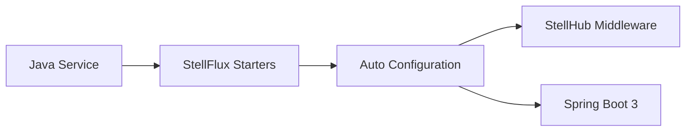

# StellFlux

`stellflux` 是 StellHub 体系中基于 Spring Boot 3 的 Java 基础框架与 Starter 集合，提供 HTTP、gRPC、负载均衡、注册发现、调度、缓存、数据源、搜索、锁和自动装配能力。

## 项目概述

本仓库定位为 Java 微服务基础框架，不直接承载具体业务逻辑，而是为业务服务和平台服务提供统一依赖、统一配置、统一自动装配和统一中间件接入方式。

## 当前状态

| 项目 | 说明 |
| --- | --- |
| 稳定性 | 开发中 |
| 项目类型 | Java 框架 / Spring Boot Starter 集合 |
| 核心框架 | Spring Boot 3 |
| 适用对象 | Java 微服务、平台服务、基础设施组件 |
| 维护方 | StellHub |

## 解决什么问题

- 统一 Java 服务依赖版本和 Starter 接入方式。
- 封装 HTTP、gRPC、缓存、数据源、搜索和分布式锁能力。
- 对接 StellMap、StellFlow、StellNula 等 StellHub 基础设施。
- 降低业务服务重复接入中间件的成本。
- 为平台服务提供一致的工程骨架。

## 不解决什么问题

- 不承载业务领域逻辑。
- 不替代具体中间件服务端。
- 不强制所有服务使用同一业务架构。

## 核心模块

| 模块 | 说明 |
| --- | --- |
| stellflux-bom | 依赖版本管理 |
| stellflux-http-client | HTTP 客户端能力 |
| stellflux-grpc-client/server | gRPC 客户端和服务端能力 |
| stellflux-stellmap | 注册发现集成 |
| stellflux-stellflow | 消息队列集成 |
| stellflux-stellnula | 配置中心集成 |
| stellflux-caffeine | 本地缓存集成 |
| stellflux-datasource | 数据源集成 |
| stellflux-lock-jedis | Redis 分布式锁集成 |
| stellflux-spring-boot-autoconfigure | 自动装配入口 |

## 架构说明



## 快速开始

```xml
<dependencyManagement>
    <dependencies>
        <dependency>
            <groupId>io.github.stellhub</groupId>
            <artifactId>stellflux-bom</artifactId>
            <version>${stellflux.version}</version>
            <type>pom</type>
            <scope>import</scope>
        </dependency>
    </dependencies>
</dependencyManagement>
```

```xml
<dependency>
    <groupId>io.github.stellhub</groupId>
    <artifactId>stellflux-spring-boot-starter-http</artifactId>
</dependency>
```

## 配置说明

| 配置项 | 是否必填 | 说明 |
| --- | --- | --- |
| stellflux.enabled | 否 | 是否启用框架能力 |
| stellflux.app.name | 是 | 应用名 |
| stellflux.env | 是 | 运行环境 |
| stellflux.zone | 否 | 可用区 |

具体配置以各 Starter 模块文档为准。

## 本地开发

```bash
mvn clean verify
```

## 版本与升级

- `MAJOR`：不兼容 API、Starter 行为或依赖版本变更。
- `MINOR`：向后兼容的新模块或新能力。
- `PATCH`：向后兼容的问题修复。

## 可观测性

StellFlux 本身应统一暴露 HTTP、gRPC、客户端调用、中间件接入和自动装配相关指标。具体指标由各 Starter 模块提供。

## 故障排查

### Starter 没有生效

1. 检查依赖是否引入正确。
2. 检查 Spring Boot 版本是否匹配。
3. 检查自动装配条件是否满足。
4. 查看启动日志中的 auto-configuration 信息。

## 安全说明

生产环境配置不应直接提交到仓库，框架默认行为必须遵守平台安全规范。

## 目录结构

```text
.
├── stellflux-bom/                         # 依赖版本管理
├── stellflux-*/                           # 基础模块
├── stellflux-spring-boot-starter-*/       # Spring Boot Starter
├── stellflux-spring-boot-autoconfigure/   # 自动装配
├── pom.xml                                # Maven 聚合工程
└── README.md                              # 项目说明
```

## 贡献规范

- 新增 Starter 必须提供配置说明和最小示例。
- 公共 API 和默认行为变更必须说明兼容性影响。
- 依赖版本升级必须评估对下游服务的影响。

## 支持

由 StellHub 维护。建议通过 GitHub Issues 记录问题、需求和设计讨论。

## 许可证

以仓库内 `LICENSE` 文件为准。