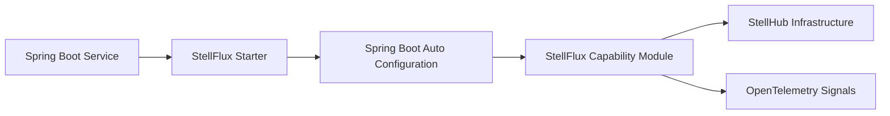

# StellFlux

[English](./README.md)

StellFlux 是 StellHub Java 生态的 Spring Boot 基础框架层。它提供一组经过统一设计的 Maven 模块、Spring Boot Starter、自动装配组件和基础设施集成能力，用于帮助 Java 服务以一致的方式接入 HTTP、gRPC、注册发现、配置中心、可观测性、缓存、数据源、分布式锁、消息队列和服务治理能力。

StellFlux 的目标不是替代业务框架，也不是把所有能力打包成单一大模块，而是让服务按需引入明确的 starter，并在保持低接入成本的同时获得稳定的默认行为。

## 项目定位

StellFlux 聚焦基础设施接入层，主要解决以下问题：

- 统一 StellHub Java 服务的依赖版本和模块边界。
- 以 Spring Boot 自动装配方式接入常见中间件能力。
- 对接 StellMap、StellNula、StellOrbit、StellPulsar、StellFlow 等 StellHub 基础设施。
- 提供一致的日志、指标和链路追踪接入方式。
- 通过细粒度 starter 降低服务按需接入能力的成本。

StellFlux 不承载业务领域逻辑，不替代具体中间件服务端，也不强制下游服务采用统一的业务架构。

## 当前状态

| 项目 | 说明 |
| --- | --- |
| 项目类型 | Java 框架 / Spring Boot Starter 集合 |
| 核心运行时 | Spring Boot 3 |
| Java 基线 | Java 25 |
| 适用对象 | Java 微服务、平台服务、基础设施组件 |
| 维护方 | StellHub |
| 稳定性 | 开发中 |

## 核心能力

| 能力方向 | 说明 |
| --- | --- |
| 依赖管理 | 通过 `stellflux-bom` 统一框架、中间件和 starter 版本 |
| HTTP | HTTP client / server starter |
| gRPC | gRPC client / server starter |
| 可观测性 | OpenTelemetry、日志、指标和链路追踪集成 |
| 注册发现 | StellMap 注册、发现和负载均衡集成 |
| 配置中心 | StellNula 配置中心集成，支持 Spring `Environment` 和动态 `@Value` 刷新 |
| 服务治理 | StellOrbit 路由、熔断、JWT 鉴权、单机限流和弱一致分布式限流 |
| 限流 | Resilience4j 单机限流和 StellPulsar 分布式限流，支持否决式和阻塞式申请 |
| 消息队列 | StellFlow 生产者和消费者集成 |
| 缓存 | Caffeine 本地缓存集成 |
| 数据源 | DataSource 自动装配和可观测性 |
| 搜索 | Elasticsearch 8.x 客户端集成 |
| 分布式锁 | 基于 Jedis 的 Redis 分布式锁，支持 token 校验释放和 TTL 续租 |
| 分布式调度 | 基于 StellMap 的调度执行权判断 |

## 模块结构

| 模块 | 说明 |
| --- | --- |
| `stellflux-bom` | 依赖版本管理 BOM |
| `stellflux-context` | 通用上下文基础能力 |
| `stellflux-opentelemetry` | OpenTelemetry 辅助 API |
| `stellflux-log` | 日志集成 |
| `stellflux-metrics` | 指标集成 |
| `stellflux-traces` | 链路追踪集成 |
| `stellflux-http-client` | HTTP 客户端能力 |
| `stellflux-grpc-client` / `stellflux-grpc-server` | gRPC 客户端和服务端能力 |
| `stellflux-loadbalancer` | 负载均衡抽象 |
| `stellflux-loadbalancer-stellmap` | 基于 StellMap 的服务实例供应器 |
| `stellflux-stellmap` | StellMap 注册中心集成 |
| `stellflux-stellnula` | StellNula 配置中心集成 |
| `stellflux-stellorbit` | StellOrbit 治理规则源和通用接线 |
| `stellflux-stellorbit-route` | 本地路由解析 |
| `stellflux-stellorbit-circuit-breaker` | Resilience4j 熔断集成 |
| `stellflux-stellorbit-auth` | JWT 鉴权集成 |
| `stellflux-stellorbit-rate-limit` | 限流公共 SPI |
| `stellflux-stellorbit-rate-limit-local` | Resilience4j 单机限流 |
| `stellflux-stellorbit-rate-limit-distributed` | 基于 StellPulsar 的分布式限流 |
| `stellflux-stellflow` | StellFlow 生产者和消费者集成 |
| `stellflux-caffeine` | Caffeine 缓存集成 |
| `stellflux-datasource` | DataSource 集成 |
| `stellflux-elaticsearch` | Elasticsearch 客户端集成 |
| `stellflux-jedis` | Jedis 客户端集成 |
| `stellflux-lock-jedis` | Redis 分布式锁集成 |
| `stellflux-scheduler-stellmap` | StellMap 调度执行权集成 |
| `stellflux-spring-boot-autoconfigure` | Spring Boot 自动装配入口 |
| `stellflux-spring-boot-starter-parent` | Spring Boot Starter 模块集合 |
| `stellflux-examples` | 可运行示例 |

## 架构概览



## 快速开始

引入 StellFlux BOM：

```xml
<dependencyManagement>
    <dependencies>
        <dependency>
            <groupId>io.github.stellhub</groupId>
            <artifactId>stellflux-bom</artifactId>
            <version>${stellflux.version}</version>
            <type>pom</type>
            <scope>import</scope>
        </dependency>
    </dependencies>
</dependencyManagement>
```

按需引入 starter：

```xml
<dependency>
    <groupId>io.github.stellhub</groupId>
    <artifactId>stellflux-spring-boot-starter-http-client</artifactId>
</dependency>
```

配置项按能力模块划分。例如，接入 StellNula 时需要引入 StellNula starter 并配置服务端地址；接入 StellOrbit 分布式限流时需要引入分布式限流 starter，并提供 StellPulsar 相关连接配置。

## Starter 选择

| 场景 | Starter |
| --- | --- |
| HTTP 客户端 | `stellflux-spring-boot-starter-http-client` |
| HTTP 服务端 | `stellflux-spring-boot-starter-http-server` |
| gRPC 客户端 | `stellflux-spring-boot-starter-grpc-client` |
| gRPC 服务端 | `stellflux-spring-boot-starter-grpc-server` |
| OpenTelemetry | `stellflux-spring-boot-starter-opentelemetry` |
| StellMap 注册中心 | `stellflux-spring-boot-starter-stellmap` |
| StellNula 配置中心 | `stellflux-spring-boot-starter-stellnula` |
| StellOrbit 路由治理 | `stellflux-spring-boot-starter-stellorbit-route` |
| StellOrbit 熔断治理 | `stellflux-spring-boot-starter-stellorbit-circuit-breaker` |
| StellOrbit JWT 鉴权 | `stellflux-spring-boot-starter-stellorbit-auth` |
| StellOrbit 单机限流 | `stellflux-spring-boot-starter-stellorbit-rate-limit` |
| StellOrbit 分布式限流 | `stellflux-spring-boot-starter-stellorbit-rate-limit-distributed` |
| StellFlow 消息队列 | `stellflux-spring-boot-starter-stellflow` |
| Caffeine 缓存 | `stellflux-spring-boot-starter-caffeine` |
| DataSource | `stellflux-spring-boot-starter-datasource` |
| Elasticsearch | `stellflux-spring-boot-starter-elaticsearch` |
| Redis 分布式锁 | `stellflux-spring-boot-starter-lock-jedis` |

完整 starter 说明见 [docs/starter-modules.md](./docs/starter-modules.md)。

## 服务治理

StellFlux 通过 StellOrbit 在本地执行治理能力，并使用 StellNula 作为治理规则下发通道。

当前治理能力包括：

- 基于 StellOrbit 规则和 StellMap 实例目录的路由解析。
- 基于 Resilience4j 的熔断。
- 基于 JWT 的鉴权。
- 基于 Resilience4j 的单机限流。
- 基于 StellPulsar 的弱一致分布式限流。

限流 SPI 同时支持否决式和阻塞式申请。默认 `acquire(request)` 是否决式语义，会立即返回判定结果；阻塞式申请可通过 `acquireBlocking(request, timeout)` 或 `RateLimitAcquireOptions.blocking(timeout)` 使用。

## 配置中心

StellNula 集成会把远端配置快照加载到 Spring `Environment`，并支持 Spring 标准 `@Value` 字段的动态刷新。应用无需使用额外的业务配置 API，即可感知配置中心变更。

StellNula starter 主要负责：

- 基于 Spring Boot 配置启动 StellNula 客户端。
- 将远端配置写入专用 `PropertySource`。
- 监听服务端配置变更并刷新 `PropertySource`。
- 在配置变化后重新解析受管理的 `@Value` 字段。

## 可观测性

StellFlux 的基础设施能力会尽可能提供一致的 OpenTelemetry 信号，包括：

- HTTP 和 gRPC 调用。
- 缓存操作。
- DataSource 活动。
- StellOrbit 路由、熔断和限流判定。
- 中间件客户端交互。

具体指标名称、span 属性和结构化日志字段由各能力模块维护，以保证和运行时行为一致。

## 示例

可运行示例位于 `stellflux-examples`。示例以最小接入方式展示单个 starter 或中间件能力，便于下游服务复制和验证。

## 构建

构建完整工程：

```bash
mvn clean verify
```

构建指定模块及其依赖：

```bash
mvn -pl <module-name> -am test
```

PowerShell 下建议给 Maven `-D` 参数加引号：

```powershell
mvn -pl stellflux-spring-boot-autoconfigure -am "-Dtest=StellfluxStellorbitAutoConfigurationTest" test
```

## 文档

| 文档 | 说明 |
| --- | --- |
| [docs/starter-modules.md](./docs/starter-modules.md) | Starter 模块矩阵和推荐用法 |
| [docs/stellorbit-governance-design.md](./docs/stellorbit-governance-design.md) | StellOrbit 服务治理集成设计 |
| [docs/http-server-telemetry-guide.md](./docs/http-server-telemetry-guide.md) | HTTP 服务端 telemetry 配置指南 |

## 兼容性和版本

StellFlux 遵循语义化版本原则：

- `MAJOR`：不兼容的 API、starter 行为或依赖基线变更。
- `MINOR`：向后兼容的新能力或新模块。
- `PATCH`：向后兼容的问题修复。

Starter 默认行为属于公开行为契约的一部分。任何可能影响下游服务的变更，都应该补充文档、示例或测试。

## 贡献规范

新增或修改能力时，请遵循以下原则：

- 保持模块边界清晰且语义单一。
- 遵循 Spring Boot 自动装配约定，优先使用构造器注入。
- 当能力需要独立接入时，提供独立 starter。
- 尽量提供配置说明和最小可运行示例。
- 修改公共 API 或 starter 默认行为前，需要评估兼容性影响。
- 让可观测信号和真实运行时决策保持一致。

## 许可证

见 [LICENSE](./LICENSE)。
