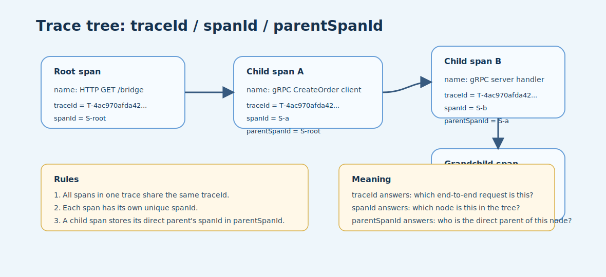
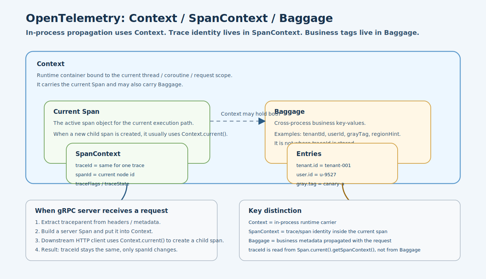
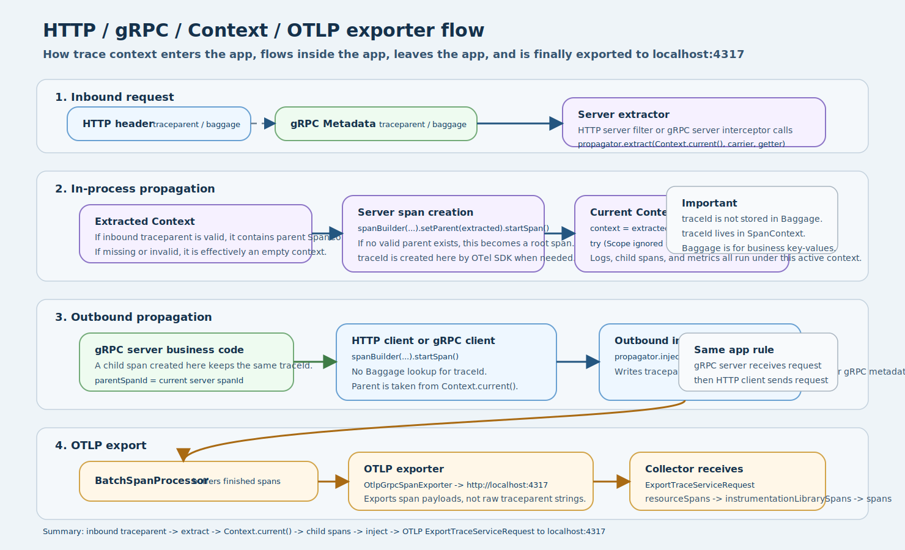

# OpenTelemetry 设计说明

## 1. 文档目标

本文档用于说明当前 `stellflux` 中 OpenTelemetry 的核心设计，重点回答下面几个问题：

- `traceId / spanId / parentSpanId` 分别表示什么
- `Context / SpanContext / Baggage` 三者分别承担什么职责
- 请求从 HTTP / gRPC 入站，到应用内透传，再到 OTLP exporter 导出到 `localhost:4317` 的完整链路是什么
- HTTP server、gRPC server、HTTP client、gRPC client 各自在链路中的角色是什么

---

## 2. 总体原则

当前实现遵循下面几条原则：

- `traceparent` 使用 W3C 标准，不自定义协议头
- `traceId` 存放在 `SpanContext` 中，不存放在 `Baggage` 中
- 应用内上下文透传依赖 `Context.current()`
- 服务端在没有上游合法 trace 上下文时，会自己创建 root span
- HTTP metrics 的 URI 必须做模版化，避免高基数爆炸
- 导出到 `localhost:4317` 时，发送的是 OTLP payload，而不是原始 `traceparent` 字符串

---

## 3. 图示

### 3.1 Trace 树关系

用于说明 `traceId / spanId / parentSpanId` 的关系：

### 3.2 Context / SpanContext / Baggage 关系

用于说明应用内传播时，哪个对象负责 trace 身份，哪个对象负责业务标签：

### 3.3 请求入站到 OTLP 导出的完整流转

用于说明 HTTP header / gRPC metadata / Context / OTLP exporter 的完整串联：

---

## 4. 核心概念

### 4.1 `traceId`

- 一整条调用链的唯一标识
- 同一条 trace 下所有 span 的 `traceId` 相同
- 当前实现中由 OpenTelemetry SDK 在需要创建 root span 时生成

### 4.2 `spanId`

- 当前 span 自身的唯一标识
- 同一条 trace 下每个 span 的 `spanId` 都不同

### 4.3 `parentSpanId`

- 当前 span 的直接父节点 `spanId`
- 如果为空，则表示这是 root span

### 4.4 `Context`

- 进程内 / 线程内 / 当前执行路径上的运行时上下文容器
- 用于承载当前活动的 span
- 也可以承载 `Baggage`

### 4.5 `SpanContext`

- 当前 span 的身份对象
- 真正包含 `traceId`、`spanId`、`traceFlags`、`traceState`

### 4.6 `Baggage`

- 用于跨服务传播业务标签
- 典型内容如：`tenantId`、`userId`、灰度标记
- 不用于保存 `traceId`

---

## 5. 当前实现链路

### 5.1 全局 OpenTelemetry 运行时

全局 runtime 在这里统一创建：

- [StellfluxOpenTelemetrySdk.java](/E:/PersonalCode/JavaProject/stellflux/stellflux-opentelemetry/src/main/java/io/github/stellflux/opentelemetry/sdk/StellfluxOpenTelemetrySdk.java:27)

这里做了几件关键事情：

- 注册 `W3CTraceContextPropagator`
- 注册 `W3CBaggagePropagator`
- 创建 `SdkTracerProvider`
- 创建 `BatchSpanProcessor`
- 创建 OTLP exporter

关键代码位置：

- propagator 配置  
  [StellfluxOpenTelemetrySdk.java](/E:/PersonalCode/JavaProject/stellflux/stellflux-opentelemetry/src/main/java/io/github/stellflux/opentelemetry/sdk/StellfluxOpenTelemetrySdk.java:50)
- traces provider 与采样器配置  
  [StellfluxOpenTelemetrySdk.java](/E:/PersonalCode/JavaProject/stellflux/stellflux-opentelemetry/src/main/java/io/github/stellflux/opentelemetry/sdk/StellfluxOpenTelemetrySdk.java:89)

### 5.1.1 `TraceId` 默认生成算法

当前 `stellflux` 没有自定义 `IdGenerator`，因此 `SdkTracerProvider.builder()` 会使用 OpenTelemetry Java SDK 默认的 `IdGenerator.random()`。基于当前项目实际依赖的 `opentelemetry-sdk-trace:1.49.0` 反编译结果可以确认：默认实现是 `RandomIdGenerator`，在标准 JDK 上通过 `ThreadLocalRandom.current()` 取随机数，连续生成两个 `long` 作为一个 128 bit 的 `traceId`，并保证结果不是全 0，最终编码为 32 位小写十六进制字符串。也就是说，当前 `traceId` 不是时间戳、雪花算法或 UUID 文本，而是符合 W3C Trace Context 预期的随机追踪标识。

这一默认实现适合生产环境中的分布式追踪场景，业界主流做法也是直接使用 OpenTelemetry 默认生成器，而不是主动自定义。只有在需要兼容历史链路 ID 格式、接入特定厂商协议，或测试中需要可预测 ID 时，才建议显式自定义 `IdGenerator`。需要注意的是，`traceId` 的职责是链路关联，不应被当作认证凭证、权限令牌或其他安全边界来使用。

### 5.2 HTTP server 入站

HTTP server telemetry 由 filter 负责：

- [StellfluxHttpServerTelemetryFilter.java](/E:/PersonalCode/JavaProject/stellflux/stellflux-spring-boot-autoconfigure/src/main/java/io/github/stellflux/http/server/config/StellfluxHttpServerTelemetryFilter.java:29)

核心行为：

1. 从 HTTP header 中提取 `traceparent`
2. 构建 server span
3. 将 span 放入当前 `Context`
4. 请求结束时记录 metrics
5. 使用 Spring MVC route template 填充 `http.route`

关键代码位置：

- 提取上游上下文  
  [StellfluxHttpServerTelemetryFilter.java](/E:/PersonalCode/JavaProject/stellflux/stellflux-spring-boot-autoconfigure/src/main/java/io/github/stellflux/http/server/config/StellfluxHttpServerTelemetryFilter.java:102)
- 服务端创建 span  
  [StellfluxHttpServerTelemetryFilter.java](/E:/PersonalCode/JavaProject/stellflux/stellflux-spring-boot-autoconfigure/src/main/java/io/github/stellflux/http/server/config/StellfluxHttpServerTelemetryFilter.java:107)
- 回写 `traceparent` 到响应头  
  [StellfluxHttpServerTelemetryFilter.java](/E:/PersonalCode/JavaProject/stellflux/stellflux-spring-boot-autoconfigure/src/main/java/io/github/stellflux/http/server/config/StellfluxHttpServerTelemetryFilter.java:118)
- 结束时补充 `http.route` 并记录指标  
  [StellfluxHttpServerTelemetryFilter.java](/E:/PersonalCode/JavaProject/stellflux/stellflux-spring-boot-autoconfigure/src/main/java/io/github/stellflux/http/server/config/StellfluxHttpServerTelemetryFilter.java:143)

### 5.3 HTTP server URI 模版化

为避免 `/orders/123`、`/orders/456` 这类路径参数导致 metrics 高基数，HTTP server 不直接使用原始 URI，而是优先读取 Spring MVC 的模版路由：

- [StellfluxHttpRouteTemplateResolver.java](/E:/PersonalCode/JavaProject/stellflux/stellflux-spring-boot-autoconfigure/src/main/java/io/github/stellflux/http/server/config/StellfluxHttpRouteTemplateResolver.java:6)

关键逻辑：

- 优先使用 `HandlerMapping.BEST_MATCHING_PATTERN_ATTRIBUTE`
- 404 使用 `NOT_FOUND`
- 其他未知场景使用 `UNKNOWN`

关键代码位置：

- route template 解析  
  [StellfluxHttpRouteTemplateResolver.java](/E:/PersonalCode/JavaProject/stellflux/stellflux-spring-boot-autoconfigure/src/main/java/io/github/stellflux/http/server/config/StellfluxHttpRouteTemplateResolver.java:20)

### 5.4 gRPC server 入站

gRPC server telemetry 由 interceptor 负责：

- [StellfluxGrpcServerTelemetryInterceptor.java](/E:/PersonalCode/JavaProject/stellflux/stellflux-grpc-server/src/main/java/io/github/stellflux/grpc/server/internal/StellfluxGrpcServerTelemetryInterceptor.java:28)

核心行为：

1. 从 gRPC `Metadata` 中提取 `traceparent`
2. 创建 server span
3. 将 span 放入当前 `Context`
4. 在 `close/onCancel/onComplete` 阶段统一补 span 状态和指标

关键代码位置：

- 提取上游上下文  
  [StellfluxGrpcServerTelemetryInterceptor.java](/E:/PersonalCode/JavaProject/stellflux/stellflux-grpc-server/src/main/java/io/github/stellflux/grpc/server/internal/StellfluxGrpcServerTelemetryInterceptor.java:93)
- 服务端创建 span  
  [StellfluxGrpcServerTelemetryInterceptor.java](/E:/PersonalCode/JavaProject/stellflux/stellflux-grpc-server/src/main/java/io/github/stellflux/grpc/server/internal/StellfluxGrpcServerTelemetryInterceptor.java:98)
- 让请求处理链运行在当前上下文中  
  [StellfluxGrpcServerTelemetryInterceptor.java](/E:/PersonalCode/JavaProject/stellflux/stellflux-grpc-server/src/main/java/io/github/stellflux/grpc/server/internal/StellfluxGrpcServerTelemetryInterceptor.java:121)

### 5.5 HTTP client 出站

HTTP client telemetry 由 OkHttp interceptor 负责：

- [StellfluxHttpClientTelemetryInterceptor.java](/E:/PersonalCode/JavaProject/stellflux/stellflux-http-client/src/main/java/io/github/stellflux/http/client/internal/StellfluxHttpClientTelemetryInterceptor.java:24)

核心行为：

1. 创建 client span
2. 使用 `Context.current()` 作为父上下文
3. 把 `traceparent` 注入到 HTTP header
4. 请求结束时记录 HTTP client 指标

关键代码位置：

- 创建 client span  
  [StellfluxHttpClientTelemetryInterceptor.java](/E:/PersonalCode/JavaProject/stellflux/stellflux-http-client/src/main/java/io/github/stellflux/http/client/internal/StellfluxHttpClientTelemetryInterceptor.java:67)
- 注入 HTTP header  
  [StellfluxHttpClientTelemetryInterceptor.java](/E:/PersonalCode/JavaProject/stellflux/stellflux-http-client/src/main/java/io/github/stellflux/http/client/internal/StellfluxHttpClientTelemetryInterceptor.java:77)

### 5.6 gRPC client 出站

gRPC client telemetry 由 client interceptor 负责：

- [StellfluxGrpcClientTelemetryInterceptor.java](/E:/PersonalCode/JavaProject/stellflux/stellflux-grpc-client/src/main/java/io/github/stellflux/grpc/client/internal/StellfluxGrpcClientTelemetryInterceptor.java:25)

核心行为：

1. 创建 client span
2. 使用 `Context.current()` 作为父上下文
3. 把 `traceparent` 注入到 gRPC `Metadata`
4. 请求结束时记录 gRPC client 指标

关键代码位置：

- 创建 client span  
  [StellfluxGrpcClientTelemetryInterceptor.java](/E:/PersonalCode/JavaProject/stellflux/stellflux-grpc-client/src/main/java/io/github/stellflux/grpc/client/internal/StellfluxGrpcClientTelemetryInterceptor.java:82)
- 注入 gRPC metadata  
  [StellfluxGrpcClientTelemetryInterceptor.java](/E:/PersonalCode/JavaProject/stellflux/stellflux-grpc-client/src/main/java/io/github/stellflux/grpc/client/internal/StellfluxGrpcClientTelemetryInterceptor.java:98)

### 5.7 OTLP 导出

Span 最终由 `BatchSpanProcessor` 批量导出到 OTLP exporter：

- `BatchSpanProcessor` 装配位置  
  [StellfluxOpenTelemetrySdk.java](/E:/PersonalCode/JavaProject/stellflux/stellflux-opentelemetry/src/main/java/io/github/stellflux/opentelemetry/sdk/StellfluxOpenTelemetrySdk.java:96)

具体 exporter 创建在：

- [OpenTelemetryExporterFactory.java](/E:/PersonalCode/JavaProject/stellflux/stellflux-opentelemetry/src/main/java/io/github/stellflux/opentelemetry/internal/OpenTelemetryExporterFactory.java:70)

当前默认配置：

- endpoint = `http://localhost:4317`
- protocol = `grpc`

对应代码：

- 默认 endpoint  
  [StellfluxOpenTelemetryConfig.java](/E:/PersonalCode/JavaProject/stellflux/stellflux-opentelemetry/src/main/java/io/github/stellflux/opentelemetry/config/StellfluxOpenTelemetryConfig.java:57)
- 默认 protocol  
  [StellfluxOpenTelemetryConfig.java](/E:/PersonalCode/JavaProject/stellflux/stellflux-opentelemetry/src/main/java/io/github/stellflux/opentelemetry/config/StellfluxOpenTelemetryConfig.java:59)
- gRPC span exporter 创建  
  [OpenTelemetryExporterFactory.java](/E:/PersonalCode/JavaProject/stellflux/stellflux-opentelemetry/src/main/java/io/github/stellflux/opentelemetry/internal/OpenTelemetryExporterFactory.java:115)

---

## 6. 标准协议与透传规则

### 6.1 请求中使用的 key

当前项目使用 W3C Trace Context 标准，关键字段如下：

- trace 透传：`traceparent`
- 可选 trace state：`tracestate`
- 业务 baggage：`baggage`

也就是说，当前没有自定义一个叫做 `traceId` 的 header。

### 6.2 同一应用内如何透传

同一应用内不是通过 `Baggage` 传 `traceId`，而是：

1. 服务端创建当前 span
2. `Context.current()` 持有当前 span
3. 下游 HTTP client / gRPC client 创建 child span 时默认继承 `Context.current()`
4. 因此 `traceId` 保持不变，只生成新的 `spanId`

### 6.3 没有上游 trace 时会发生什么

如果入站请求没有合法 `traceparent`：

- HTTP server 会在服务端创建 root span
- gRPC server 也会在服务端创建 root span

这意味着“服务端也能开启 trace”，不是只有客户端才能生成。

---

## 7. 指标命名

当前内置指标名统一使用下划线风格，避免点分风格混入：

- [StellfluxMetricNames.java](/E:/PersonalCode/JavaProject/stellflux/stellflux-metrics/src/main/java/io/github/stellflux/metrics/StellfluxMetricNames.java:4)

HTTP / gRPC 相关内置指标包括：

- `stellflux_http_client_requests`
- `stellflux_http_client_duration`
- `stellflux_http_server_requests`
- `stellflux_http_server_duration`
- `stellflux_grpc_client_requests`
- `stellflux_grpc_client_duration`
- `stellflux_grpc_server_requests`
- `stellflux_grpc_server_duration`

---

## 8. 关键测试

### 8.1 Span OTLP 数据结构测试

用于观察单个服务导出父子 span 时，collector 收到的 `ExportTraceServiceRequest` 长什么样：

- [StellfluxOpenTelemetryGrpcSpanExportModelTest.java](/E:/PersonalCode/JavaProject/stellflux/stellflux-opentelemetry/src/test/java/io/github/stellflux/opentelemetry/sdk/StellfluxOpenTelemetryGrpcSpanExportModelTest.java:1)

### 8.2 跨 HTTP / gRPC 链路测试

用于验证从 HTTP client 到 HTTP bridge，再到 gRPC server 的完整 trace 透传与 OTLP 导出结构：

- [StellfluxOpenTelemetryCrossProtocolTraceExportTest.java](/E:/PersonalCode/JavaProject/stellflux/stellflux-spring-boot-autoconfigure/src/test/java/io/github/stellflux/opentelemetry/integration/StellfluxOpenTelemetryCrossProtocolTraceExportTest.java:1)

### 8.3 HTTP server root span 与路由模版测试

用于验证 HTTP server 在没有上游 trace 时会自己创建 root span，并把 `http.route` 模版化：

- [StellfluxHttpServerTelemetryFilterTest.java](/E:/PersonalCode/JavaProject/stellflux/stellflux-spring-boot-autoconfigure/src/test/java/io/github/stellflux/http/server/config/StellfluxHttpServerTelemetryFilterTest.java:38)
- [StellfluxHttpRouteTemplateResolverTest.java](/E:/PersonalCode/JavaProject/stellflux/stellflux-spring-boot-autoconfigure/src/test/java/io/github/stellflux/http/server/config/StellfluxHttpRouteTemplateResolverTest.java:14)

---

## 9. 当前结论

当前 `stellflux` 的 OpenTelemetry 设计可以总结为：

- 统一使用标准 `traceparent`
- 服务端和客户端都参与 trace 建立与透传
- 应用内使用 `Context.current()` 透传当前 span
- `traceId` 来自 `SpanContext`，不是来自 `Baggage`
- `Baggage` 只承载业务标签
- HTTP server metrics 已做 URI 模版化，避免高基数爆炸
- 最终通过 OTLP exporter 将 traces / metrics / logs 统一导出到 `localhost:4317`
