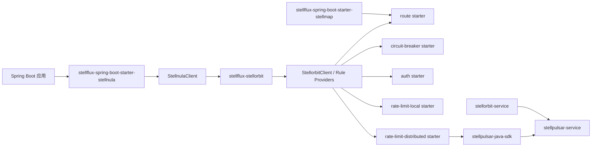

# StellOrbit 服务治理接入设计

## 背景

`stellorbit-java-sdk` 是 StellOrbit 服务治理规则的数据面 SDK。它通过 Stellnula 订阅治理规则，在本地维护不可变规则注册表，并暴露四类强类型规则 Provider：

- `RouteRuleProvider`
- `CircuitBreakerRuleProvider`
- `AuthorizationRuleProvider`
- `RateLimitRuleProvider`

SDK 本身不实现路由执行、熔断状态机、鉴权拦截器或限流算法。`stellflux` 的职责是在 Spring Boot 自动装配层把规则 Provider 和运行时能力连接起来，并按照能力维度提供低接入成本的 starter。

## 目标

- 接入 `stellhub/stellorbit-java-sdk` 作为服务治理规则来源。
- 规则下发通道复用 `stellflux-stellnula`，StellOrbit 自动装配必须以 Stellnula 装配完成为前置条件。
- 将四个核心能力拆成独立模块和独立 starter：
  - 路由
  - 熔断
  - 鉴权
  - 限流
- 路由能力必须以注册中心装配完成为前置条件。
- 鉴权默认使用 JWT。
- 熔断和本地限流默认采用 Resilience4j。
- 限流能力拆分为单机限流和分布式限流。
- 分布式限流仅支持 StellPulsar 弱一致实现，通过 `stellpulsar-java-sdk` 访问 `stellpulsar-service`。

## 非目标

- 不在 `stellflux` 中实现 StellOrbit 控制面规则 CRUD。
- 不让业务应用直接感知 Stellnula 规则订阅细节。
- 不把四个治理能力打成单一大 starter 作为唯一入口。
- 不在核心公共模块中强制引入 Spring MVC、Spring Security、Redis 或 Resilience4j 运行时依赖。
- 不在 `stellflux` 客户端侧实现 Redis 强一致限流或直连 Redis 扣减。

## 总体架构



核心接线原则：

- `stellflux-stellorbit` 是公共底座模块，只负责规则客户端、规则源适配、公共配置和 SPI。
- 四个能力模块依赖公共底座，但能力之间互不依赖。
- 四个能力 starter 是用户接入入口，分别按需引入。
- 路由 starter 额外依赖 StellMap 注册中心 starter。
- 鉴权、熔断、单机限流 starter 只要求 Stellnula 规则源可用。
- 分布式限流 starter 额外依赖 `stellpulsar-java-sdk` 和可访问的 `stellpulsar-service`。

## Stellnula 前置条件

`stellorbit-java-sdk` 提供了基于 Stellnula 的规则源能力，默认规则通道为：

| 字段 | 默认值 |
| --- | --- |
| `namespace` | `governance` |
| `group` | `service-governance` |
| `format` | `json` |

在 `stellflux` 自动装配中不建议让 StellOrbit SDK 再创建一个新的 Stellnula 客户端。推荐做法是复用 `stellflux-stellnula` 已经装配完成的 `StellnulaClient`：

- `StellfluxStellorbitAutoConfiguration` 使用 `@AutoConfiguration(after = StellfluxStellnulaAutoConfiguration.class)`。
- 公共客户端 Bean 使用 `@ConditionalOnBean(StellnulaClient.class)`。
- 如果没有引入 `stellflux-spring-boot-starter-stellnula` 或没有配置 `stellflux.stellnula.endpoint`，StellOrbit 公共客户端不启动。
- 公共规则源只关闭自己注册的 listener，不关闭共享的 `StellnulaClient`。

这样可以避免：

- 同一个应用创建两条 Stellnula 连接。
- StellOrbit 关闭时误关闭配置中心客户端。
- 规则治理和配置中心的启动顺序不可控。

## 模块规划

### 公共模块

| 模块 | 职责 |
| --- | --- |
| `stellflux-stellorbit` | 持有 `stellorbit-java-sdk` 依赖，提供公共 options、rule source adapter、client factory、customizer SPI |
| `stellflux-stellorbit-route` | 路由规则解析后的运行时适配，依托 StellMap 服务发现选择目标实例 |
| `stellflux-stellorbit-circuit-breaker` | 熔断规则到 Resilience4j CircuitBreaker 的适配 |
| `stellflux-stellorbit-auth` | 鉴权规则到 JWT 校验和请求鉴权拦截的适配 |
| `stellflux-stellorbit-rate-limit` | 限流公共 API、规则模型适配和限流实现 SPI |
| `stellflux-stellorbit-rate-limit-local` | 单机限流实现，默认基于 Resilience4j RateLimiter，只依赖 StellOrbit 规则 Provider |
| `stellflux-stellorbit-rate-limit-distributed` | 弱一致分布式限流实现，依赖 `stellpulsar-java-sdk` 请求远端配额 |

公共模块同时提供 `StellorbitTelemetry`，用于三类运行时能力统一发射：

- `stellflux_stellorbit_decisions` counter。
- `stellflux_stellorbit_duration` histogram。
- `StellOrbit <capability> <operation>` trace span。
- `stellorbit.governance.decision` 结构化 OpenTelemetry log。

### Starter 模块

| Starter | 依赖 | 启动条件 |
| --- | --- | --- |
| `stellflux-spring-boot-starter-stellorbit-route` | `stellflux-stellorbit-route`、`stellflux-spring-boot-starter-stellnula`、`stellflux-spring-boot-starter-stellmap` | `StellnulaClient` 和 StellMap 客户端均存在 |
| `stellflux-spring-boot-starter-stellorbit-circuit-breaker` | `stellflux-stellorbit-circuit-breaker`、`stellflux-spring-boot-starter-stellnula`、Resilience4j | `StellnulaClient` 存在 |
| `stellflux-spring-boot-starter-stellorbit-auth` | `stellflux-stellorbit-auth`、`stellflux-spring-boot-starter-stellnula`、JWT 依赖 | `StellnulaClient` 存在 |
| `stellflux-spring-boot-starter-stellorbit-rate-limit-local` | `stellflux-stellorbit-rate-limit`、`stellflux-stellorbit-rate-limit-local`、`stellflux-spring-boot-starter-stellnula`、Resilience4j | `StellnulaClient` 存在 |
| `stellflux-spring-boot-starter-stellorbit-rate-limit-distributed` | `stellflux-stellorbit-rate-limit`、`stellflux-stellorbit-rate-limit-distributed`、`stellflux-spring-boot-starter-stellnula`、`stellpulsar-java-sdk` | `StellnulaClient` 存在，且 StellPulsar 可访问 |

限流必须拆成两个独立 starter。单机限流用户不应该被 `stellpulsar-java-sdk`、gRPC runtime、topology 缓存或远端配额调用依赖污染；分布式限流用户也不应该默认启用本地 Resilience4j 限流器作为同一条规则的第二次扣减。

当前保留已经存在的 `stellflux-spring-boot-starter-stellorbit-rate-limit` 作为单机限流入口，并新增 `stellflux-spring-boot-starter-stellorbit-rate-limit-distributed` 作为分布式限流入口。后续如果需要更强命名一致性，可以再新增显式的 `rate-limit-local` starter 作为单机入口别名，避免一个 starter 同时承担两种限流语义。

## 自动装配顺序

公共自动装配：

```java
@AutoConfiguration(after = StellfluxStellnulaAutoConfiguration.class)
@ConditionalOnClass(StellorbitClient.class)
@ConditionalOnBean(StellnulaClient.class)
@EnableConfigurationProperties(StellfluxStellorbitProperties.class)
public class StellfluxStellorbitAutoConfiguration {
}
```

能力自动装配：

| 自动装配类 | 顺序 | Bean 条件 |
| --- | --- | --- |
| `StellfluxStellorbitRouteAutoConfiguration` | after `StellfluxStellorbitAutoConfiguration` 和 `StellfluxStellMapAutoConfiguration` | `StellorbitClient`、StellMap 客户端 |
| `StellfluxStellorbitCircuitBreakerAutoConfiguration` | after `StellfluxStellorbitAutoConfiguration` | `StellorbitClient` |
| `StellfluxStellorbitAuthAutoConfiguration` | after `StellfluxStellorbitAutoConfiguration` | `StellorbitClient` |
| `StellfluxStellorbitLocalRateLimitAutoConfiguration` | after `StellfluxStellorbitAutoConfiguration` | `StellorbitClient`、Resilience4j |
| `StellfluxStellorbitDistributedRateLimitAutoConfiguration` | after `StellfluxStellorbitAutoConfiguration` | `StellorbitClient`、`StellpulsarClient` 或 `stellpulsar-java-sdk` 相关类型 |

公共 Bean 建议：

- `StellfluxStellorbitProperties`
- `StellfluxStellorbitClientOptions`
- `StellfluxStellorbitClientOptionsCustomizer`
- `GovernanceRuleSource`
- `StellorbitClient`
- `RouteRuleProvider`
- `CircuitBreakerRuleProvider`
- `AuthorizationRuleProvider`
- `RateLimitRuleProvider`

## 配置设计

最小配置只需要配置 Stellnula，因为治理规则通过 Stellnula 下发：

```yaml
spring:
  application:
    name: order-service

stellflux:
  stellnula:
    endpoint: http://127.0.0.1:8060
  stellorbit:
    target-service: ${spring.application.name}
```

默认值：

| 配置项 | 默认值 | 说明 |
| --- | --- | --- |
| `stellflux.stellorbit.target-service` | `${spring.application.name}` | 当前应用在治理规则中的服务名 |
| `stellflux.stellorbit.rule-namespace` | `governance` | Stellnula 规则 namespace |
| `stellflux.stellorbit.rule-group` | `service-governance` | Stellnula 规则 group |
| `stellflux.stellorbit.watch-enabled` | `true` | 是否监听规则变更 |
| `stellflux.stellorbit.fail-fast-on-bootstrap` | `false` | 规则初始化失败是否快速失败 |
| `stellflux.stellorbit.snapshot-directory` | 复用 Stellnula 默认 | 本地规则快照目录 |
| `stellflux.stellorbit.rate-limit.mode` | `auto` | 限流实现选择，支持 `auto`、`local`、`distributed` |

四个能力不提供 `enabled` 开关。是否启用由是否引入对应 starter 决定。

## 路由能力设计

路由能力依赖两个前置条件：

- Stellnula 已完成装配，用于加载路由规则。
- StellMap 已完成装配，用于发现目标服务实例。

路由流程：

1. 从请求上下文构建 `RouteRuleQuery`。
2. 通过 `RouteRuleProvider` 查询匹配规则。
3. 根据规则中的目标服务、权重、标签或灰度条件选择候选目标；存在 `routeKey` 时使用稳定权重分流。
4. 通过 StellMap 获取目标服务实例。
5. 交给现有负载均衡组件完成实例选择。

路由 starter 不应该绕开现有 `stellflux-loadbalancer-stellmap`。它应作为规则决策层，最终仍复用当前服务发现和负载均衡模型。

## 熔断能力设计

熔断默认使用 Resilience4j：

- 使用 `CircuitBreakerRuleProvider` 查询规则。
- 将规则内容转换为 Resilience4j `CircuitBreakerConfig`。
- 按 `targetService + operation` 维护 `CircuitBreaker` 实例。
- 规则变更后按 `ruleId@revision` 重建配置，并淘汰同一规则的旧 revision breaker。
- 监听 Resilience4j state transition 事件并发射治理日志。
- 默认提供方法级和客户端调用级适配点。

建议优先支持：

- HTTP client 调用熔断。
- gRPC client 调用熔断。
- 显式 API 包装：`StellfluxCircuitBreakerExecutor`。

后续再评估注解式接入，例如 `@StellorbitCircuitBreaker`。

## 鉴权能力设计

鉴权默认使用 JWT。默认实现建议基于 Spring Security 生态中的 JWT 能力，底层使用 Nimbus JOSE/JWT：

- 如果应用已经引入 Spring Security，则优先提供 `JwtDecoder` 和安全过滤链适配。
- 如果应用没有引入完整 Spring Security，则提供轻量级 Servlet `HandlerInterceptor` 作为默认接入。
- 鉴权规则通过 `AuthorizationRuleProvider` 获取。
- 请求进入时解析 JWT，提取 `subject`、`tenantId`、`roles`、`scopes` 等属性。
- 构造 `AuthorizationRuleQuery` 匹配规则。
- 无匹配规则时默认放行还是拒绝，需要配置化，建议默认拒绝只对明确保护路径生效。

建议配置：

```yaml
stellflux:
  stellorbit:
    auth:
      jwt:
        issuer-uri: https://issuer.example.com
        jwk-set-uri: https://issuer.example.com/.well-known/jwks.json
      default-policy: deny
```

## 限流能力设计

限流需要明确拆分为两个实现：单机限流和弱一致分布式限流。二者共享 StellOrbit 规则 Provider，但运行时依赖、故障模型和性能边界不同，应分别由独立 starter 接入。

### 单机限流

默认使用 Resilience4j RateLimiter：

- 性能高。
- 无外部依赖。
- 只保证单实例内限流。
- 适合单体服务、本地开发、小规模副本数场景。
- 只依赖 `stellorbit-java-sdk` 提供的 `RateLimitRuleProvider`，不访问 StellPulsar。
- 规则变更后按 `ruleId@revision:quotaKey` 重建本地 limiter，并淘汰同一规则的旧 revision limiter。

限流 key 建议来源：

- `tenantId`
- `quotaKey`
- `userId`
- `clientId`
- `routeKey`
- 自定义 header 或请求属性

### 弱一致分布式限流

分布式限流使用 `stellpulsar-java-sdk` 访问 `stellpulsar-service`，仅支持弱一致的 `local-owner-single-writer` 模型：

- `stellorbit-service` 是限流规则控制面，负责保存、校验、发布和回滚规则。
- `stellpulsar-service` 通过 StellOrbit runtime API 拉取已经发布的分布式限流规则，并保留 last-known-good 运行时快照。
- `stellflux` 应用侧通过 `stellorbit-java-sdk` 匹配当前请求命中的限流规则。
- `stellpulsar-java-sdk` 从匹配规则中过滤分布式限流规则，构造 `RateLimitRequest`，并通过 gRPC `AcquireQuota` 请求远端配额。
- `stellpulsar-service` 校验 `rule_revision`、`rule_checksum`、`topology_revision` 和 `target_instance_id` 后，在 owner 实例本地扣减 quota bucket。
- 多节点场景通过 `rendezvous_hash_v1` 把 `application_code + rule_id + quota_key` 路由到同一 owner；topology 变化或 owner 异常时允许短期有限偏差。
- `stellflux` 客户端不实现 Redis 强一致限流，也不直接操作 Redis 计数器。

适用场景：

- 高 QPS 读接口。
- 可容忍短时间轻微超发的租户、用户或资源配额。
- 需要跨实例共享配额，但不希望把强一致计数器放到请求热路径的服务。

分布式限流请求映射建议：

| StellFlux 请求字段 | StellPulsar 字段 |
| --- | --- |
| 当前应用名 | `applicationCode` |
| 匹配到的规则 ID | `ruleId` |
| 匹配到的规则版本 | `ruleRevision` |
| 匹配到的规则 checksum | `ruleChecksum` |
| `quotaKey` 或按维度拼出的 key | `quotaKey` |
| 本次请求消耗 | `cost` |
| 租户、用户、资源、方法、路径等 | `attributes` |

分布式限流 starter 的故障处理：

- 未匹配到分布式限流规则时直接放行，不访问 StellPulsar。
- StellOrbit 本地规则不可用时使用 last-known-good；没有 last-known-good 时默认 fail-open。
- StellPulsar gRPC 不可用、topology 为空、规则 checksum 冲突或 owner 路由连续失败时，按规则 fail policy 降级。
- 规则未显式声明 fail policy 时默认 fail-open，并记录 warn 日志和指标。
- 客户端侧保留 StellPulsar 返回的 `remaining`、`retryAfterMs`、`fallback`、`errorCode`、`ruleRevision` 和 `ruleChecksum`，便于业务响应头、日志排障和降级审计。
- 本地请求字段非法时返回 `INVALID_REQUEST` 判定并记录异常 span/log，不再让参数解析异常直接击穿业务调用链。

## 运行时 SPI

建议在公共限流模块中抽象：

```java
public interface StellorbitRateLimiter {

    RateLimitDecision acquire(RateLimitRequest request);
}
```

建议在路由模块中抽象：

```java
public interface StellorbitRouteResolver {

    RouteDecision route(RouteRequest request);
}
```

建议在鉴权模块中抽象：

```java
public interface StellorbitAuthorizationManager {

    AuthorizationDecision authorize(AuthorizationRequest request);
}
```

建议在熔断模块中抽象：

```java
public interface StellorbitCircuitBreakerExecutor {

    <T> T execute(CircuitBreakerRequest request, Supplier<T> supplier);
}
```

这些 SPI 应先放在能力模块中，避免公共底座过早膨胀。

## 规则更新与一致性

规则更新链路：

1. `stellorbit-service` 发布治理规则到 Stellnula。
2. `stellflux-stellnula` 通过 watch 接收配置变更。
3. `stellflux-stellorbit` 规则源解析快照并原子替换本地注册表。
4. 四个能力模块监听规则变化或按调用时读取最新 Provider。
5. 运行时对象按规则版本增量刷新。

建议原则：

- 查询规则 Provider 是轻量操作，可以请求时读取。
- Resilience4j 对象、StellPulsar topology/session、JWT decoder 这类运行时对象需要缓存。
- 规则非法时保留上一版 last-known-good 配置。
- 单个 Stellnula 配置项可以解析为多条治理规则，删除和 fallback 按 `configId/configKey` 维度处理。
- 启动失败默认不阻断应用，生产环境可通过 `fail-fast-on-bootstrap=true` 改为快速失败。

## 接入优先级

建议分三期落地：

### 第一阶段：公共底座和规则可见性

- 新增 `stellflux-stellorbit`。
- 接入 `stellorbit-java-sdk`。
- 复用已有 `StellnulaClient`。
- 暴露四类 Provider Bean。
- 增加启动日志，输出规则通道、当前服务名、规则数量。

### 第二阶段：单机能力闭环

- 路由 starter 接入 StellMap。
- 熔断 starter 接入 Resilience4j CircuitBreaker。
- 鉴权 starter 接入 JWT。
- 限流 starter 接入 Resilience4j RateLimiter 单机限流。
- 增加 example 模块和最小配置。

### 第三阶段：分布式限流

- 新增 `stellflux-stellorbit-rate-limit-distributed`。
- 新增 `stellflux-spring-boot-starter-stellorbit-rate-limit-distributed`。
- 接入 `stellpulsar-java-sdk`，完成 `RateLimitRequest` 映射、远端配额判定和 fail policy 降级策略。
- 处理 `RULE_STALE`、`SERVER_RULE_LAG`、`RULE_CONFLICT`、`NOT_OWNER`、`SHARD_MIGRATING` 等分布式决策。
- 统一发射 StellOrbit 指标、结构化治理日志和链路追踪。

## 验证计划

单元测试：

- Stellnula 前置条件缺失时不创建 StellOrbit 客户端。
- Stellnula 装配完成后创建公共 `StellorbitClient`。
- 路由缺少 StellMap 时不启动路由能力。
- 四类 Provider 能随规则变更返回最新规则。
- Resilience4j 配置能从规则转换。
- JWT 鉴权能提取 subject、tenant、roles、scopes。
- 单机限流能按 quotaKey 限制。
- 分布式限流能把 StellOrbit 规则映射为 `stellpulsar-java-sdk` 的 `RateLimitRequest`。
- 分布式限流能处理 StellPulsar 的允许、拒绝、规则冲突、服务端规则滞后、owner redirect 和降级结果。

集成测试：

- 启动 Stellnula 后发布规则，应用无需重启即可生效。
- 引入单个 starter 只启动对应能力。
- 同时引入四个 starter 时共享同一个 `StellorbitClient`。
- 路由 starter 在 StellMap 服务实例变更后能选择最新实例。

## 待确认问题

- `stellorbit-service` 当前控制面 validator 是否已经允许 `AUTH` 规则发布。
- 路由规则 payload 中目标服务、权重、标签字段是否需要和 `stellflux-loadbalancer-stellmap` 现有模型做字段映射约定。
- JWT 默认策略是未命中规则放行还是拒绝，需要结合产品安全默认值确认。
- 分布式限流规则中用于区分单机和 StellPulsar 的字段应最终固定为 `mode`、`backend` 还是已有 StellOrbit 服务端枚举。
- StellPulsar gRPC 连接信息应由固定 endpoint 配置、StellMap 服务发现，还是二者都支持。
